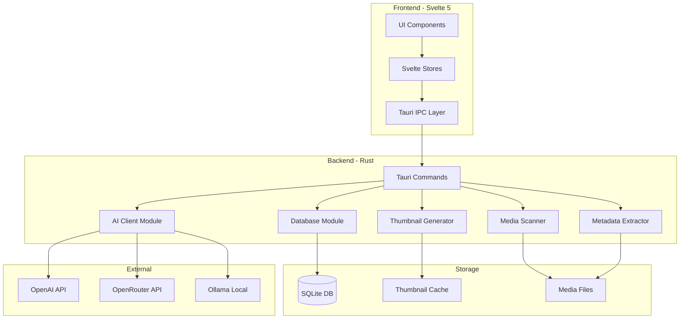
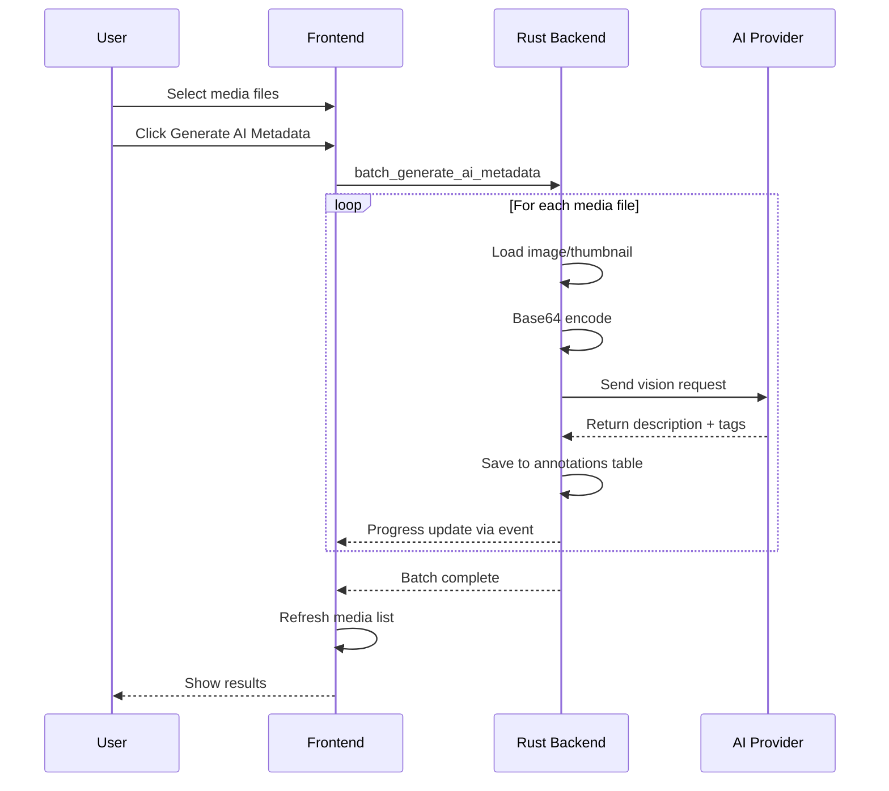

# nocap Media Manager - Architecture Document

## Overview

Transform the existing minimal image viewer into a full-featured cross-platform media manager with project-based organization, metadata management, and AI-powered tagging.

## System Architecture



## Project Structure

```
.nocap/                    # Hidden folder in project root
├── metadata.db            # SQLite database
└── thumbnails/            # Generated thumbnails cache
    ├── images/
    └── videos/
```

## Data Models

### Database Schema

```sql
-- Projects are represented by their root path, stored in app settings
-- The database lives inside .nocap/ in the project folder

-- Media files discovered during scanning
CREATE TABLE media_files (
    id INTEGER PRIMARY KEY AUTOINCREMENT,
    path TEXT NOT NULL UNIQUE,           -- Relative path from project root
    filename TEXT NOT NULL,
    extension TEXT NOT NULL,
    media_type TEXT NOT NULL,            -- image, video, audio
    file_size INTEGER,
    file_hash TEXT,                       -- For detecting changes
    created_at TEXT,                      -- File creation time
    modified_at TEXT,                     -- File modification time
    scanned_at TEXT NOT NULL,            -- When we last scanned this file
    thumbnail_path TEXT                   -- Path to generated thumbnail
);

-- Embedded metadata extracted from files
CREATE TABLE embedded_metadata (
    id INTEGER PRIMARY KEY AUTOINCREMENT,
    media_file_id INTEGER NOT NULL UNIQUE,
    width INTEGER,
    height INTEGER,
    duration_seconds REAL,               -- For video/audio
    bit_rate INTEGER,
    codec TEXT,
    -- Image EXIF
    camera_make TEXT,
    camera_model TEXT,
    lens TEXT,
    focal_length TEXT,
    aperture TEXT,
    shutter_speed TEXT,
    iso INTEGER,
    taken_at TEXT,
    gps_latitude REAL,
    gps_longitude REAL,
    -- Audio ID3
    title TEXT,
    artist TEXT,
    album TEXT,
    year INTEGER,
    genre TEXT,
    track_number INTEGER,
    -- Raw JSON for additional metadata
    raw_metadata TEXT,
    FOREIGN KEY (media_file_id) REFERENCES media_files(id) ON DELETE CASCADE
);

-- User-defined tags
CREATE TABLE tags (
    id INTEGER PRIMARY KEY AUTOINCREMENT,
    name TEXT NOT NULL UNIQUE,
    color TEXT                           -- Optional hex color for UI
);

-- Many-to-many relationship between media and tags
CREATE TABLE media_tags (
    media_file_id INTEGER NOT NULL,
    tag_id INTEGER NOT NULL,
    PRIMARY KEY (media_file_id, tag_id),
    FOREIGN KEY (media_file_id) REFERENCES media_files(id) ON DELETE CASCADE,
    FOREIGN KEY (tag_id) REFERENCES tags(id) ON DELETE CASCADE
);

-- User annotations for media files
CREATE TABLE annotations (
    id INTEGER PRIMARY KEY AUTOINCREMENT,
    media_file_id INTEGER NOT NULL UNIQUE,
    rating INTEGER CHECK (rating >= 0 AND rating <= 5),  -- 0-5 stars
    comment TEXT,
    notes TEXT,
    favorite INTEGER DEFAULT 0,          -- Boolean flag
    ai_description TEXT,                 -- AI-generated description
    ai_tags TEXT,                        -- AI-suggested tags (JSON array)
    updated_at TEXT NOT NULL,
    FOREIGN KEY (media_file_id) REFERENCES media_files(id) ON DELETE CASCADE
);

-- Settings for AI providers
CREATE TABLE ai_settings (
    id INTEGER PRIMARY KEY AUTOINCREMENT,
    provider TEXT NOT NULL,              -- openai, openrouter, ollama
    api_key TEXT,                        -- Encrypted or stored securely
    base_url TEXT,                       -- For Ollama or custom endpoints
    model TEXT,                          -- Model identifier
    is_active INTEGER DEFAULT 0
);

-- Indexes for common queries
CREATE INDEX idx_media_type ON media_files(media_type);
CREATE INDEX idx_media_path ON media_files(path);
CREATE INDEX idx_annotations_rating ON annotations(rating);
CREATE INDEX idx_annotations_favorite ON annotations(favorite);
```

### TypeScript Types

```typescript
// src/lib/types.ts

export type MediaType = 'image' | 'video' | 'audio';

export interface MediaFile {
  id: number;
  path: string;
  filename: string;
  extension: string;
  mediaType: MediaType;
  fileSize: number | null;
  createdAt: string | null;
  modifiedAt: string | null;
  thumbnailPath: string | null;
}

export interface EmbeddedMetadata {
  width: number | null;
  height: number | null;
  durationSeconds: number | null;
  // Image EXIF
  cameraMake: string | null;
  cameraModel: string | null;
  focalLength: string | null;
  aperture: string | null;
  shutterSpeed: string | null;
  iso: number | null;
  takenAt: string | null;
  gpsLatitude: number | null;
  gpsLongitude: number | null;
  // Audio
  title: string | null;
  artist: string | null;
  album: string | null;
  year: number | null;
  genre: string | null;
}

export interface Tag {
  id: number;
  name: string;
  color: string | null;
}

export interface Annotation {
  rating: number;          // 0-5
  comment: string | null;
  notes: string | null;
  favorite: boolean;
  aiDescription: string | null;
  aiTags: string[] | null;
}

export interface MediaFileWithDetails extends MediaFile {
  metadata: EmbeddedMetadata | null;
  annotation: Annotation | null;
  tags: Tag[];
}

export interface Project {
  path: string;
  name: string;
  mediaCount: number;
  lastOpened: string;
}

export interface FilterOptions {
  mediaTypes: MediaType[];
  minRating: number;
  maxRating: number;
  tags: number[];          // Tag IDs
  favorite: boolean | null;
  searchQuery: string;
}

export interface SortOptions {
  field: 'filename' | 'createdAt' | 'modifiedAt' | 'rating' | 'fileSize';
  direction: 'asc' | 'desc';
}

export interface AIProvider {
  provider: 'openai' | 'openrouter' | 'ollama';
  apiKey: string | null;
  baseUrl: string | null;
  model: string;
  isActive: boolean;
}
```

### Rust Types

```rust
// src-tauri/src/models.rs

use serde::{Deserialize, Serialize};

#[derive(Debug, Clone, Serialize, Deserialize)]
#[serde(rename_all = "lowercase")]
pub enum MediaType {
    Image,
    Video,
    Audio,
}

#[derive(Debug, Clone, Serialize, Deserialize)]
#[serde(rename_all = "camelCase")]
pub struct MediaFile {
    pub id: i64,
    pub path: String,
    pub filename: String,
    pub extension: String,
    pub media_type: MediaType,
    pub file_size: Option<i64>,
    pub created_at: Option<String>,
    pub modified_at: Option<String>,
    pub thumbnail_path: Option<String>,
}

#[derive(Debug, Clone, Serialize, Deserialize)]
#[serde(rename_all = "camelCase")]
pub struct EmbeddedMetadata {
    pub width: Option<i32>,
    pub height: Option<i32>,
    pub duration_seconds: Option<f64>,
    pub camera_make: Option<String>,
    pub camera_model: Option<String>,
    pub focal_length: Option<String>,
    pub aperture: Option<String>,
    pub shutter_speed: Option<String>,
    pub iso: Option<i32>,
    pub taken_at: Option<String>,
    pub gps_latitude: Option<f64>,
    pub gps_longitude: Option<f64>,
    pub title: Option<String>,
    pub artist: Option<String>,
    pub album: Option<String>,
    pub year: Option<i32>,
    pub genre: Option<String>,
}

#[derive(Debug, Clone, Serialize, Deserialize)]
#[serde(rename_all = "camelCase")]
pub struct Tag {
    pub id: i64,
    pub name: String,
    pub color: Option<String>,
}

#[derive(Debug, Clone, Serialize, Deserialize)]
#[serde(rename_all = "camelCase")]
pub struct Annotation {
    pub rating: i32,
    pub comment: Option<String>,
    pub notes: Option<String>,
    pub favorite: bool,
    pub ai_description: Option<String>,
    pub ai_tags: Option<Vec<String>>,
}
```

## Rust Crate Dependencies

Add to `Cargo.toml`:

```toml
[dependencies]
# Existing
tauri = { version = "2.0", features = ["protocol-asset"] }
tauri-plugin-dialog = "2.0"
serde = { version = "1.0", features = ["derive"] }
serde_json = "1.0"

# New dependencies
rusqlite = { version = "0.32", features = ["bundled"] }
walkdir = "2.5"                    # Recursive directory traversal
image = "0.25"                     # Image processing & thumbnails
kamadak-exif = "0.5"              # EXIF metadata extraction
id3 = "1.14"                       # MP3 ID3 tags
symphonia = "0.5"                  # Audio metadata (broader format support)
ffmpeg-next = "7.0"               # Video processing (optional, for thumbnails)
reqwest = { version = "0.12", features = ["json"] }  # HTTP client for AI APIs
tokio = { version = "1", features = ["full"] }
chrono = { version = "0.4", features = ["serde"] }
sha2 = "0.10"                      # File hashing
base64 = "0.22"                    # For AI image encoding
```

## Module Structure

```
src-tauri/src/
├── lib.rs              # Main entry, command registration
├── main.rs             # Application bootstrap
├── commands/           # Tauri command handlers
│   ├── mod.rs
│   ├── project.rs      # Project open/close/list
│   ├── media.rs        # Media file operations
│   ├── metadata.rs     # Embedded metadata extraction
│   ├── annotations.rs  # User annotations CRUD
│   ├── tags.rs         # Tag management
│   ├── thumbnails.rs   # Thumbnail generation
│   └── ai.rs           # AI provider operations
├── db/                 # Database layer
│   ├── mod.rs
│   ├── schema.rs       # Schema initialization
│   └── queries.rs      # SQL queries
├── scanner/            # Media file scanning
│   └── mod.rs
├── extractors/         # Metadata extractors
│   ├── mod.rs
│   ├── image.rs        # EXIF extraction
│   ├── audio.rs        # ID3/audio metadata
│   └── video.rs        # Video metadata
├── ai/                 # AI integration
│   ├── mod.rs
│   ├── openai.rs
│   ├── openrouter.rs
│   └── ollama.rs
└── utils.rs            # Shared utilities
```

## Frontend Structure

```
src/lib/
├── types.ts                    # Shared TypeScript types
├── api/                        # Tauri IPC wrappers
│   ├── project.ts
│   ├── media.ts
│   ├── annotations.ts
│   ├── tags.ts
│   └── ai.ts
├── stores/                     # Svelte stores
│   ├── project.ts              # Current project state
│   ├── media.ts                # Media list with filters
│   ├── selection.ts            # Selected media items
│   ├── viewer.ts               # (existing) viewer state
│   ├── ui.ts                   # (existing) UI state
│   └── settings.ts             # (existing) settings
├── components/
│   ├── project/
│   │   ├── ProjectSelector.svelte
│   │   └── RecentProjects.svelte
│   ├── gallery/
│   │   ├── Gallery.svelte
│   │   ├── GalleryItem.svelte
│   │   └── MediaTypeIcon.svelte
│   ├── detail/
│   │   ├── DetailPanel.svelte
│   │   ├── MetadataDisplay.svelte
│   │   ├── AnnotationEditor.svelte
│   │   ├── TagEditor.svelte
│   │   └── MediaPreview.svelte
│   ├── toolbar/
│   │   ├── FilterBar.svelte
│   │   ├── SortDropdown.svelte
│   │   └── ViewToggle.svelte
│   ├── ai/
│   │   ├── AIConfigDialog.svelte
│   │   └── BatchProcessDialog.svelte
│   └── (existing components...)
└── actions/
    └── open.ts                 # (existing) file open actions
```

## UI Layout

```
┌──────────────────────────────────────────────────────────────┐
│ Title Bar                                    [_] [□] [X]     │
├──────────────────────────────────────────────────────────────┤
│ Toolbar: [Filter ▼] [Sort ▼] [View: Grid/List] [AI ▼] [⚙]  │
├─────────────────────────────────────────┬────────────────────┤
│                                         │                    │
│                                         │   Detail Panel     │
│           Gallery Grid                  │   ─────────────    │
│                                         │   Preview          │
│   [img] [img] [img] [img]              │                    │
│   [img] [vid] [aud] [img]              │   Metadata         │
│   [img] [img] [img] [vid]              │   ─────────────    │
│                                         │   EXIF/ID3 info    │
│                                         │                    │
│                                         │   Annotations      │
│                                         │   ─────────────    │
│                                         │   ★★★☆☆           │
│                                         │   Tags: [x] [y]    │
│                                         │   Comment: ...     │
│                                         │                    │
├─────────────────────────────────────────┴────────────────────┤
│ Status: 234 items | 45 selected | Scanning...               │
└──────────────────────────────────────────────────────────────┘
```

## AI Integration Flow



## Implementation Phases

### Phase 1: Core Infrastructure
- Add SQLite dependency and database initialization
- Create database schema with migrations
- Project open/create commands
- Basic TypeScript types

### Phase 2: Media Scanning
- Extend supported formats (audio/video)
- Recursive directory scanning with walkdir
- File hash calculation for change detection

### Phase 3: Metadata Extraction
- EXIF extraction using kamadak-exif
- ID3 extraction using id3 crate
- Video metadata using ffmpeg-next or symphonia
- Store in embedded_metadata table

### Phase 4: Custom Metadata
- Annotations CRUD (ratings, comments, notes)
- Tags CRUD (create, assign, remove)
- Favorite toggle

### Phase 5: Thumbnail Generation
- Image thumbnails using image crate
- Video thumbnails using ffmpeg-next
- Thumbnail caching in .nocap/thumbnails/

### Phase 6-8: UI Implementation
- Project selector and recent projects
- Gallery grid with lazy loading
- Detail panel with metadata and annotations

### Phase 9: Organization Features
- Filter by type, rating, tags, favorites
- Sort by various fields

### Phase 10: AI Integration
- AI provider configuration
- OpenAI, OpenRouter, Ollama clients
- Batch processing with progress

### Phase 11: Polish
- Keyboard shortcuts
- Drag and drop
- Progress indicators
- Documentation

## Commit Strategy

Each phase should be broken into multiple small commits:

```
feat: add rusqlite dependency
feat: create database schema initialization
feat: add project open command
feat: add media file scanning with walkdir
feat: implement exif extraction
...
```

This ensures each commit is buildable, passes validation, and represents a logical unit of work.
