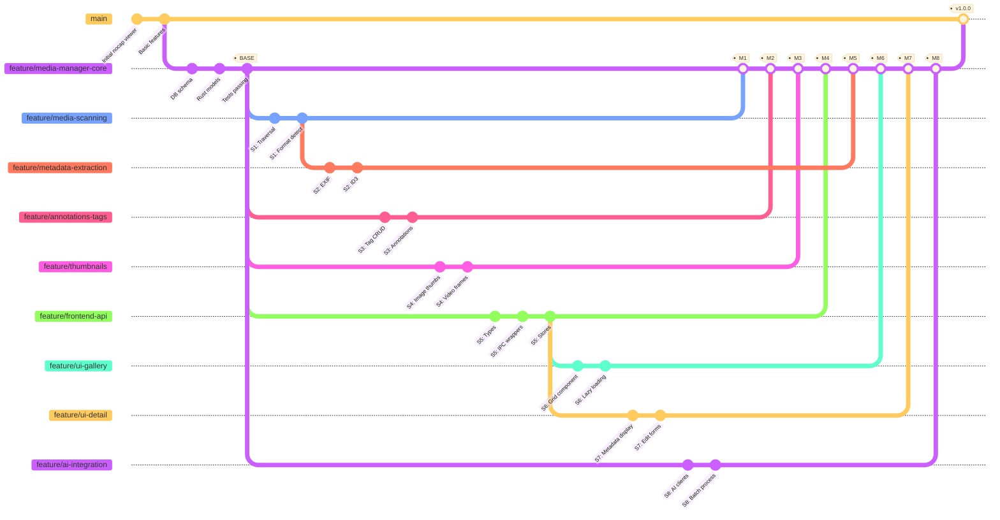

# Parallel Development Plan: Media Manager Transformation

**Project**: nocap → Media Manager  
**Current State**: `feature/media-manager-core` branch with database schema, models, passing tests  
**Remaining Work**: 35 tasks across 11 phases  
**Strategy**: 8 parallel feature streams for accelerated development

---

## Table of Contents

- [Overview](#overview)
- [Development Streams](#development-streams)
- [Branch Strategy Visualization](#branch-strategy-visualization)
- [Integration Strategy](#integration-strategy)
- [Git Workflow](#git-workflow)
- [Timeline & Milestones](#timeline--milestones)
- [Best Practices](#best-practices)
- [Risk Mitigation](#risk-mitigation)

---

## Overview

### Why Parallel Development?

**Sequential development estimate**: 11 weeks (1 phase per week)  
**Parallel development estimate**: 4-5 weeks (8 streams working concurrently)  
**Time savings**: ~60% reduction in calendar time

### Core Principles

1. **Small, reviewable commits** - Each stream follows commit-oriented development
2. **Frequent synchronization** - Rebase daily to stay current
3. **Independent validation** - Each branch must pass all checks before merge
4. **Clear dependencies** - Understand what blocks what

---

## Development Streams

### Stream 1: Media Scanning & Discovery

**Branch**: `feature/media-scanning`  
**Base**: `feature/media-manager-core`  
**Can work independently**: ✅ Yes

#### Scope & Deliverables

- Recursive directory traversal (Rust)
- Multi-format detection (images, videos, audio)
- File hash calculation for deduplication
- Initial database insertion logic
- Tauri command: `scan_directory(path: String)`

#### Dependencies

- **Depends on**: Core database schema (already in base)
- **Blocks**: None (other streams can mock scan results)

#### Implementation Notes

```rust
// Expected signature
#[tauri::command]
async fn scan_directory(path: String) -> Result<Vec<MediaFile>, String>
```

- Use `walkdir` crate for traversal
- Support image extensions: jpg, png, gif, webp, heic
- Support video extensions: mp4, mov, avi, mkv
- Support audio extensions: mp3, flac, wav, m4a

---

### Stream 2: Metadata Extraction

**Branch**: `feature/metadata-extraction`  
**Base**: `feature/media-manager-core`  
**Can work independently**: ⚠️ Partial (benefits from Stream 1 but can work with mocked files)

#### Scope & Deliverables

- EXIF extraction for images (camera, location, date)
- ID3 tag parsing for audio (artist, album, year)
- Video metadata (duration, codec, resolution)
- Tauri commands: `extract_metadata(file_id: i64)`

#### Dependencies

- **Depends on**: Database schema (in base)
- **Synergy with**: Stream 1 (scanning) - will share file type detection logic
- **Blocks**: Stream 7 (detail panel needs metadata to display)

#### Implementation Notes

```rust
// Libraries to use
// - rexiv2 or kamadak-exif for EXIF
// - id3 crate for audio tags
// - ffprobe wrapper for video metadata
```

- Store metadata as JSON in `media_files.metadata` column
- Extract common fields to typed columns (width, height, duration)
- Handle missing/corrupted metadata gracefully

---

### Stream 3: Custom Annotations & Tags

**Branch**: `feature/annotations-tags`  
**Base**: `feature/media-manager-core`  
**Can work independently**: ✅ Yes

#### Scope & Deliverables

- CRUD operations for tags (create, read, update, delete)
- CRUD operations for annotations (text notes on media)
- Many-to-many tagging (media ↔ tags)
- Tauri commands: `create_tag`, `tag_media`, `add_annotation`, etc.

#### Dependencies

- **Depends on**: Database schema (in base)
- **Blocks**: Stream 7 (UI needs tag/annotation API)

#### Implementation Notes

```rust
// Example commands
#[tauri::command]
async fn create_tag(name: String, color: Option<String>) -> Result<Tag, String>

#[tauri::command]
async fn tag_media(media_id: i64, tag_id: i64) -> Result<(), String>

#[tauri::command]
async fn add_annotation(media_id: i64, text: String) -> Result<Annotation, String>
```

- Use database transactions for consistent state
- Support tag hierarchies or categories (future)
- Validate tag names (no duplicates, reasonable length)

---

### Stream 4: Thumbnail Generation

**Branch**: `feature/thumbnails`  
**Base**: `feature/media-manager-core`  
**Can work independently**: ✅ Yes

#### Scope & Deliverables

- Image thumbnail generation (resize to 256x256, 512x512)
- Video thumbnail extraction (first frame or middle frame)
- Thumbnail caching on disk
- Tauri command: `generate_thumbnail(file_id: i64, size: u32)`

#### Dependencies

- **Depends on**: Database schema (in base)
- **Blocks**: Stream 6 (gallery needs thumbnails)

#### Implementation Notes

```rust
// Libraries
// - image crate for image resizing
// - ffmpeg or gstreamer for video frames
```

- Store thumbnails in platform-appropriate cache dir
- Use file hash as cache key to avoid regeneration
- Support lazy generation (generate on demand)
- Store thumbnail paths in `media_files.thumbnail_path`

---

### Stream 5: Frontend Types & API Layer

**Branch**: `feature/frontend-api`  
**Base**: `feature/media-manager-core`  
**Can work independently**: ✅ Yes (TypeScript only)

#### Scope & Deliverables

- TypeScript types matching Rust models (MediaFile, Tag, Annotation, etc.)
- IPC wrapper functions (type-safe invoke calls)
- Svelte stores for media state management
- Error handling utilities

#### Dependencies

- **Depends on**: Rust models in base (for type matching)
- **Blocks**: Streams 6, 7 (UI needs typed API)

#### Implementation Notes

```typescript
// src/lib/types/media.ts
export interface MediaFile {
	id: number;
	file_path: string;
	media_type: "Image" | "Video" | "Audio";
	width: number | null;
	height: number | null;
	// ... match Rust MediaFile struct
}

// src/lib/api/media.ts
export async function scanDirectory(path: string): Promise<MediaFile[]> {
	return invoke("scan_directory", { path });
}

// src/lib/stores/media.ts
export const mediaFiles = writable<MediaFile[]>([]);
export const currentMedia = writable<MediaFile | null>(null);
```

- Use `zod` or similar for runtime validation
- Create error boundary utilities
- Guard against stale async responses (as per project rules)

---

### Stream 6: UI - Gallery View

**Branch**: `feature/ui-gallery`  
**Base**: `feature/media-manager-core`  
**Can work independently**: ⚠️ No (needs Stream 5 types, benefits from Stream 4 thumbnails)

#### Scope & Deliverables

- Grid component for media thumbnails
- Lazy loading / virtualization
- Filtering and sorting controls
- Selection handling (single/multi)
- Component: `MediaGallery.svelte`

#### Dependencies

- **Depends on**: Stream 5 (frontend types/API)
- **Benefits from**: Stream 4 (thumbnails) - can use placeholders initially
- **Synergy with**: Stream 1 (scanning) for populating gallery

#### Implementation Notes

```svelte
<!-- src/lib/components/MediaGallery.svelte -->
<script lang="ts">
  import type { MediaFile } from '$lib/types/media';
  // Use virtual scrolling library or implement basic pagination
  // Props: files, onSelect, selectedIds
</script>
```

- Keep component small and focused (project rule)
- Use CSS Grid for layout
- Implement keyboard navigation (arrow keys, enter)
- Support drag-to-select (optional enhancement)

---

### Stream 7: UI - Detail Panel

**Branch**: `feature/ui-detail`  
**Base**: `feature/media-manager-core`  
**Can work independently**: ⚠️ No (needs Streams 2, 3, 5)

#### Scope & Deliverables

- Metadata display panel (EXIF, tags, annotations)
- Inline editing forms for tags and annotations
- Preview component integration
- Component: `MediaDetailPanel.svelte`

#### Dependencies

- **Depends on**: Stream 5 (frontend types/API)
- **Depends on**: Stream 2 (metadata extraction) for data
- **Depends on**: Stream 3 (tags/annotations) for CRUD operations

#### Implementation Notes

```svelte
<!-- src/lib/components/MediaDetailPanel.svelte -->
<script lang="ts">
  import type { MediaFile } from '$lib/types/media';
  export let media: MediaFile | null;
  // Display metadata, tags, annotations
  // Forms for editing
</script>
```

- Show read-only metadata (EXIF, dimensions, etc.)
- Editable fields: tags, annotations, custom notes
- Validate inputs before API calls
- Handle loading and error states

---

### Stream 8: AI Integration

**Branch**: `feature/ai-integration`  
**Base**: `feature/media-manager-core`  
**Can work independently**: ✅ Yes (can work with mocked media)

#### Scope & Deliverables

- OpenAI/Router/Ollama client setup (Rust)
- Image description generation
- Batch processing queue
- Tauri commands: `generate_description(file_id: i64, provider: String)`

#### Dependencies

- **Depends on**: Database schema (in base)
- **Benefits from**: Stream 1 (scanning) for batch processing
- **Optional**: Stream 4 (thumbnails) to send smaller images to API

#### Implementation Notes

```rust
// Use reqwest for HTTP clients
// Support multiple providers with trait-based abstraction
trait AIProvider {
    async fn describe_image(&self, image_path: &str) -> Result<String, Error>;
}

struct OpenAIClient { /* ... */ }
struct OllamaClient { /* ... */ }
```

- Store API keys securely (use `keyring` crate or env vars)
- Implement rate limiting
- Store generated descriptions in `media_files.ai_description`
- Support batch processing with progress updates

---

## Branch Strategy Visualization



### Stream Independence Matrix

| Stream | Can Start Immediately | Depends On | Blocks |
| ------ | --------------------- | ---------- | ------ |
| S1     | ✅                    | Base only  | None   |
| S2     | ✅                    | Base only  | S7     |
| S3     | ✅                    | Base only  | S7     |
| S4     | ✅                    | Base only  | S6     |
| S5     | ✅                    | Base only  | S6, S7 |
| S6     | ⚠️                    | S5 (types) | None   |
| S7     | ⚠️                    | S2,S3,S5   | None   |
| S8     | ✅                    | Base only  | None   |

**Legend**: ✅ Independent | ⚠️ Has dependencies

---

## Integration Strategy

### Merge Order & Checkpoints

#### Phase 1: Foundation Streams (Week 1-2)

Merge in this order:

1. **Stream 5 (Frontend API)** - Required by UI streams
   - Validation: TypeScript check, types match Rust models
2. **Stream 1 (Media Scanning)** - Core functionality
   - Validation: Can scan test directory, insert to DB
3. **Stream 3 (Annotations/Tags)** - Independent, needed by UI
   - Validation: CRUD operations work, transactions succeed
4. **Stream 4 (Thumbnails)** - Independent, needed by gallery
   - Validation: Generate thumbs for test images/videos

**Checkpoint 1**: Can scan media, create tags, generate thumbnails

#### Phase 2: Feature Completion (Week 3)

5. **Stream 2 (Metadata Extraction)** - Data for detail panel
   - Validation: Extract EXIF/ID3, store correctly
6. **Stream 6 (UI Gallery)** - First UI component
   - Validation: Display thumbnails, selection works
7. **Stream 8 (AI Integration)** - Additional feature
   - Validation: Generate descriptions, batch works

**Checkpoint 2**: Gallery view functional, metadata available

#### Phase 3: Final Integration (Week 4)

8. **Stream 7 (UI Detail Panel)** - Last UI component
   - Validation: Display all metadata, editing works

**Checkpoint 3**: Full media manager functionality

### Conflict Resolution Strategy

#### Preventing Conflicts

1. **Daily rebase**: Each stream rebases on `feature/media-manager-core` every morning
2. **Communication**: Use shared doc to note which files you're modifying
3. **Small commits**: Easier to rebase, easier to resolve conflicts

#### Common Conflict Zones

| Area                            | Streams Affected      | Resolution                                        |
| ------------------------------- | --------------------- | ------------------------------------------------- |
| `src-tauri/src/lib.rs`          | All Rust streams      | Merge command registrations alphabetically        |
| `src-tauri/capabilities/*.json` | Streams adding perms  | Merge permissions arrays                          |
| `src/lib/types.ts`              | S5, S6, S7            | S5 owns this file, others wait for S5 to merge    |
| `src-tauri/Cargo.toml`          | S1,S2,S4,S8           | Merge dependencies alphabetically                 |
| Database schema                 | Should not conflict   | Base has schema, streams only add migrations      |

#### When Conflicts Occur

```bash
# Example: Conflict in src-tauri/src/lib.rs
git checkout feature/media-scanning
git rebase feature/media-manager-core

# Conflict in lib.rs (command registration)
# 1. Edit lib.rs to include BOTH sets of commands
# 2. Ensure alphabetical order
# 3. Test build

cargo build
git add src-tauri/src/lib.rs
git rebase --continue
```

### Testing Approach

#### Per-Stream Testing

Each stream must pass before requesting merge:

**Frontend validation**:

```bash
npm run format:check
npm run lint
npm run check
```

**Backend validation**:

```bash
cd src-tauri
cargo fmt --check
cargo clippy --all-targets --all-features
cargo build
```

**Manual testing**:

- Document test procedure in PR description
- Test on Linux (primary), Windows/macOS if possible

#### Integration Testing

After merging each stream:

1. **Smoke test**: App starts, no console errors
2. **Feature test**: New functionality works as expected
3. **Regression test**: Existing features still work
4. **Build test**: Production build succeeds

#### Final Integration Testing

Before merging `feature/media-manager-core` to `main`:

- Full manual test suite (document in PR)
- Cross-platform testing (Linux, macOS, Windows)
- Performance testing (scan 1000+ files)
- Database migration testing (fresh DB, existing DB)

---

## Git Workflow

### Creating Development Streams

```bash
# Start from the base branch
git checkout feature/media-manager-core
git pull origin feature/media-manager-core

# Create your stream branch
git checkout -b feature/media-scanning

# Make small, focused commits
# ... do work ...
git add src-tauri/src/scanner.rs
git commit -m "feat: implement recursive directory traversal"

# Push to remote
git push -u origin feature/media-scanning
```

### Daily Synchronization (Rebase Strategy)

**Every morning before starting work**:

```bash
# Update base branch
git checkout feature/media-manager-core
git pull origin feature/media-manager-core

# Rebase your stream
git checkout feature/media-scanning
git rebase feature/media-manager-core

# If conflicts, resolve and continue
# git add <resolved-files>
# git rebase --continue

# Force push after rebase (only to your stream branch!)
git push --force-with-lease origin feature/media-scanning
```

**Why daily rebasing?**

- Keeps your stream current with other merged work
- Prevents massive conflicts at merge time
- Catches integration issues early
- Maintains linear history

### Validation Before Push

**Create a git hook** (`.git/hooks/pre-push`):

```bash
#!/bin/bash
# Validate frontend
npm run format:check || exit 1
npm run lint || exit 1
npm run check || exit 1

# Validate backend
cd src-tauri
cargo fmt --check || exit 1
cargo clippy --all-targets --all-features -- -D warnings || exit 1
cd ..

echo "✅ All validations passed"
```

Make it executable:

```bash
chmod +x .git/hooks/pre-push
```

### Creating Pull Requests

When your stream is ready to merge:

```bash
# Ensure you're up to date
git checkout feature/media-manager-core
git pull origin feature/media-manager-core
git checkout feature/media-scanning
git rebase feature/media-manager-core

# Final validation
npm run format:check && npm run lint && npm run check
cd src-tauri && cargo fmt --check && cargo clippy --all-targets --all-features
cd ..

# Push final version
git push origin feature/media-scanning

# Open PR on GitHub/GitLab:
# Base: feature/media-manager-core
# Compare: feature/media-scanning
```

**PR Template**:

```markdown
## Stream: [Name]

### Summary

Brief description of what this stream implements.

### Changes

- List of major changes
- New files added
- Modified files

### Testing

Manual test procedure:

1. Step 1
2. Step 2
3. Expected result

### Dependencies

- [ ] Requires Stream X to be merged first
- [ ] Can merge independently

### Checklist

- [ ] All validations pass (format, lint, check, clippy)
- [ ] Manual testing completed
- [ ] No merge conflicts with base
- [ ] Git history is clean (rebased, no merge commits)
- [ ] Commit messages follow convention
```

### Merging Strategy

When merging PRs to `feature/media-manager-core`:

1. **Squash merge** if commits are messy/WIP
2. **Rebase merge** if commits are clean and meaningful (preferred)
3. **Never** regular merge (creates merge commits, messy history)

```bash
# Reviewer merging via command line (rebase merge)
git checkout feature/media-manager-core
git pull origin feature/media-manager-core
git rebase feature/media-scanning
git push origin feature/media-manager-core

# Delete merged stream branch
git branch -d feature/media-scanning
git push origin --delete feature/media-scanning
```

---

## Timeline & Milestones

### Work Distribution

Assuming 8 developers (1 per stream) working simultaneously:

| Week | Milestone                               | Streams Active         | Target               |
| ---- | --------------------------------------- | ---------------------- | -------------------- |
| 1    | Foundation & Infrastructure             | S1,S3,S4,S5,S8         | 5 streams complete   |
| 2    | Backend Integration                     | S2, refinements        | All backend complete |
| 3    | Frontend Development                    | S6,S7                  | All UI complete      |
| 4    | Integration, Testing, Polish            | All streams merged     | Ready for main merge |
| 5    | Final QA, Documentation, Release prep   | On `main`              | v1.0.0 release       |

### Sequential vs Parallel Comparison

#### Sequential Development (11 weeks)

```
Week 1: Database & Models
Week 2: Media Scanning
Week 3: Metadata Extraction
Week 4: Tags & Annotations
Week 5: Thumbnails
Week 6: Frontend Types
Week 7: AI Integration
Week 8: Gallery UI
Week 9: Detail Panel UI
Week 10: Integration Testing
Week 11: Polish & Release
```

#### Parallel Development (4-5 weeks)

```
Week 1: S1,S3,S4,S5,S8 (5 streams in parallel)
Week 2: S2,S6 + refinements
Week 3: S7 + integration
Week 4: Testing & merge to main
Week 5: Release (optional buffer)
```

**Time savings**: 6-7 weeks (60-65% reduction)

### Weekly Milestones

#### Week 1: Foundation Sprint

**Goals**:

- ✅ Stream 5 merged (frontend types)
- ✅ Stream 1 merged (media scanning)
- ✅ Stream 3 merged (tags/annotations)
- ✅ Stream 4 merged (thumbnails)

**Deliverable**: Can scan directories, add tags, generate thumbnails from CLI/API

#### Week 2: Backend Completion

**Goals**:

- ✅ Stream 2 merged (metadata extraction)
- ✅ Stream 8 merged (AI integration)
- 🔧 Begin Stream 6 (gallery UI) - depends on S5

**Deliverable**: Full backend API complete, all data available

#### Week 3: Frontend Development

**Goals**:

- ✅ Stream 6 merged (gallery view)
- ✅ Stream 7 merged (detail panel)
- 🔧 Integration testing across all features

**Deliverable**: Complete UI, full media manager functionality

#### Week 4: Integration & Testing

**Goals**:

- 🧪 Cross-platform testing
- 🧪 Performance testing (1000+ files)
- 🧪 Database migration testing
- 📝 Update documentation
- ✅ Merge `feature/media-manager-core` to `main`

**Deliverable**: Production-ready media manager

#### Week 5: Release (Optional)

**Goals**:

- 🚀 Build distributions for Linux/macOS/Windows
- 📝 Write release notes
- 🎉 Tag v1.0.0
- 📣 Announce release

**Deliverable**: Public v1.0.0 release

---

## Best Practices

### Commit Discipline

Follow the project's commit-oriented development:

**Good commit**:

```
feat: add recursive directory scanning

Implements walkdir-based traversal with depth limiting.
Filters for supported image/video extensions.
Returns Vec<PathBuf> for discovered media files.
```

**Bad commit**:

```
wip stuff

// ... 500 lines changed across 10 files
```

### Branch Hygiene

1. **Keep branches short-lived**: Merge within 1-2 weeks max
2. **No work-in-progress pushes**: Every push should build and pass validation
3. **Rebase, don't merge**: Keep linear history
4. **Delete after merge**: Clean up stale branches

### Communication

**Daily standup** (async, Slack/Discord):

- What stream are you working on?
- What files are you modifying today?
- Any blockers or dependencies?

**Weekly sync**:

- Review merge progress
- Identify conflicts or integration issues
- Adjust timeline if needed

### Code Reviews

**Review checklist**:

- [ ] Commits follow convention (feat:, fix:, etc.)
- [ ] Each commit builds successfully
- [ ] No unrelated changes (formatting, refactoring)
- [ ] Tests pass (manual testing documented)
- [ ] Code follows project style (Clippy, ESLint)
- [ ] New dependencies justified
- [ ] Database changes include migrations
- [ ] Tauri commands registered in lib.rs

**Review SLA**: 24-48 hours max for feedback

---

## Risk Mitigation

### Common Risks & Mitigations

| Risk                                  | Likelihood | Impact | Mitigation                                             |
| ------------------------------------- | ---------- | ------ | ------------------------------------------------------ |
| Merge conflicts in lib.rs             | High       | Low    | Daily rebasing, alphabetical ordering                  |
| Stream dependency delays              | Medium     | Medium | S6,S7 can use mocks until dependencies merge           |
| Breaking changes to base schema       | Low        | High   | Freeze schema after initial merge, use migrations      |
| Developer illness/unavailability      | Medium     | Medium | Pair programming, knowledge sharing                    |
| Diverging architectural decisions     | Medium     | High   | Weekly architecture review, shared design doc          |
| Integration test failures             | Medium     | Medium | Integrate early and often, smoke test after each merge |

### Rollback Plan

If a merged stream breaks `feature/media-manager-core`:

```bash
# Identify the problematic merge commit
git log --oneline

# Revert the merge
git revert -m 1 <merge-commit-hash>

# Push the revert
git push origin feature/media-manager-core

# Fix issues on the stream branch
git checkout feature/media-scanning
# ... fix issues ...
git push origin feature/media-scanning

# Re-merge when ready
```

### Fallback to Sequential

If parallel development proves too complex:

1. Merge foundation streams first (S1, S5)
2. Switch to sequential: S4 → S3 → S2 → S6 → S7 → S8
3. Still faster than original 11-week plan (~7 weeks)

---

## Appendices

### A. Quick Reference

**Key branches**:

- `main` - Production releases
- `feature/media-manager-core` - Integration branch for all streams
- `feature/media-scanning` - Stream 1
- `feature/metadata-extraction` - Stream 2
- `feature/annotations-tags` - Stream 3
- `feature/thumbnails` - Stream 4
- `feature/frontend-api` - Stream 5
- `feature/ui-gallery` - Stream 6
- `feature/ui-detail` - Stream 7
- `feature/ai-integration` - Stream 8

**Daily commands**:

```bash
# Morning sync
git checkout feature/media-manager-core && git pull
git checkout <your-stream> && git rebase feature/media-manager-core

# Before push
npm run format:check && npm run lint && npm run check
cd src-tauri && cargo fmt --check && cargo clippy --all-targets --all-features

# Push
git push --force-with-lease origin <your-stream>
```

### B. Tools & Resources

**Recommended tools**:

- `git-branchless` - Better rebasing and conflict resolution
- `lazygit` - Terminal UI for Git
- GitHub CLI (`gh`) - Create PRs from terminal
- `watchexec` - Auto-run validations on file change

**Documentation**:

- [Project AGENTS.md](../AGENTS.md) - Core development guidelines
- [Architecture overview](./architecture.md) - System design
- [Troubleshooting](./troubleshooting.md) - Common issues

### C. Success Metrics

Track these metrics weekly:

- **Merge velocity**: Number of streams merged per week
- **Conflict rate**: Conflicts per rebase (target: <5%)
- **Review time**: PR open → approved (target: <48h)
- **Build success rate**: Pushes that pass CI (target: >95%)
- **Integration issues**: Bugs found after merge (target: <2 per stream)

---

**Document Version**: 1.0  
**Last Updated**: 2025-12-19  
**Maintained By**: nocap development team  
**Review Cadence**: Weekly during parallel development phase
